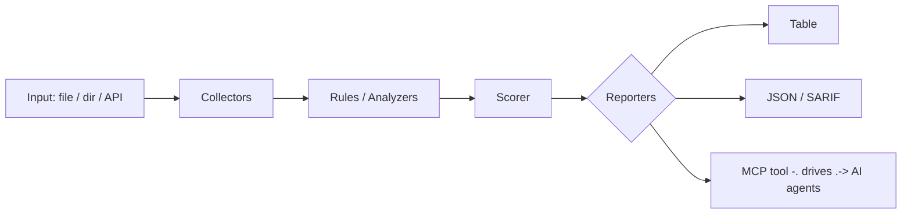

<a name="top"></a>
<div align="center">


# ENRICHR

### Enrich a leads CSV with firmographics, tech stack, and contact validation from pluggable providers, caching results to avoid duplicate API spend.


[](#install--every-way-every-platform) [](https://github.com/cognis-digital/enrichr/actions) [](LICENSE) [](https://github.com/cognis-digital)

*Part of the Cognis Neural Suite.*

</div>

```bash
pip install "git+https://github.com/cognis-digital/enrichr.git"
enrichr scan .            # → prioritized findings in seconds
```

<!-- cognis:layman:start -->
## What is this?

Enrichr takes a spreadsheet of sales leads (email addresses and company names) and automatically fills in missing details about each company — like what industry they're in, how big the company is, and what country they're based in. It works entirely offline without paying for a data service, using smart guesses from the company's web address. It's built for sales teams, marketers, and developers who want to clean up and expand their contact lists before importing them into a CRM or running an outreach campaign.
<!-- cognis:layman:end -->

## Contents

- [Why enrichr?](#why) · [Features](#features) · [Quick start](#quick-start) · [Example](#example) · [Architecture](#architecture) · [AI stack](#ai-stack) · [How it compares](#how-it-compares) · [Integrations](#integrations) · [Install anywhere](#install-anywhere) · [Related](#related) · [Contributing](#contributing)

<a name="why"></a>
## Why enrichr?

Provider-agnostic enrichment you self-host — swap Clearbit for a free source via config, and a local cache means CI reruns never re-bill you for the same record.

`enrichr` is single-purpose, scriptable, and self-hostable: point it at a target, get prioritized results in the format your workflow already speaks (table · JSON · SARIF), gate CI on it, and let agents drive it over MCP.

<div align="right"><a href="#top">↑ back to top</a></div>

<a name="features"></a>
## Features

- ✅ Normalize Domain
- ✅ Domain From Email
- ✅ Is Free Email Domain
- ✅ Company Size Bucket
- ✅ Read Leads Csv
- ✅ Write Results Csv
- ✅ Enrich Leads
- ✅ Runs on Linux/macOS/Windows · Docker · devcontainer
- ✅ Ports in Python, JavaScript, Go, and Rust (`ports/`)

<div align="right"><a href="#top">↑ back to top</a></div>

<a name="quick-start"></a>
<!-- cognis:install:start -->
## Install

`enrichr` is source-available (not published to PyPI) — every method below installs
straight from GitHub. Pick whichever you prefer; the one-line scripts auto-detect
the best tool available on your machine.

**One-liner (Linux / macOS):**
```sh
curl -fsSL https://raw.githubusercontent.com/cognis-digital/enrichr/HEAD/install.sh | sh
```

**One-liner (Windows PowerShell):**
```powershell
irm https://raw.githubusercontent.com/cognis-digital/enrichr/HEAD/install.ps1 | iex
```

**Or install manually — any one of:**
```sh
pipx install "git+https://github.com/cognis-digital/enrichr.git"     # isolated (recommended)
uv tool install "git+https://github.com/cognis-digital/enrichr.git"  # uv
pip install "git+https://github.com/cognis-digital/enrichr.git"      # pip
```

**From source:**
```sh
git clone https://github.com/cognis-digital/enrichr.git
cd enrichr && pip install .
```

Then run:
```sh
enrichr --help
```
<!-- cognis:install:end -->

## Quick start

```bash
pip install "git+https://github.com/cognis-digital/enrichr.git"
enrichr --version
enrichr scan .                       # scan current project
enrichr scan . --format json         # machine-readable
enrichr scan . --fail-on high        # CI gate (non-zero exit)
```

<div align="right"><a href="#top">↑ back to top</a></div>

<a name="example"></a>
## Example

```text
$ enrichr scan .
  [HIGH    ] ENR-001  example finding             (./src/app.py)
  [MEDIUM  ] ENR-002  another signal              (./config.yaml)

  2 findings · risk score 5 · 38ms
```

<div align="right"><a href="#top">↑ back to top</a></div>

<a name="architecture"></a>
## Architecture



<div align="right"><a href="#top">↑ back to top</a></div>

<a name="ai-stack"></a>
## Use it from any AI stack

`enrichr` is interoperable with every popular way of using AI:

- **MCP server** — `enrichr mcp` (Claude Desktop, Cursor, Cognis.Studio, [uncensored-fleet](https://github.com/cognis-digital/uncensored-fleet))
- **OpenAI-compatible / JSON** — pipe `enrichr scan . --format json` into any agent or LLM
- **LangChain · CrewAI · AutoGen · LlamaIndex** — wrap the CLI/JSON as a tool in one line
- **CI / scripts** — exit codes + SARIF for non-AI pipelines

<div align="right"><a href="#top">↑ back to top</a></div>

<a name="how-it-compares"></a>
## How it compares

| | **Cognis enrichr** | Clearbit |
|---|:---:|:---:|
| Self-hostable, no account | ✅ | varies |
| Single command, zero config | ✅ | ⚠️ |
| JSON + SARIF for CI | ✅ | varies |
| MCP-native (AI agents) | ✅ | ❌ |
| Polyglot ports (JS/Go/Rust) | ✅ | ❌ |
| Open license | ✅ COCL | varies |

*Built in the spirit of **Clearbit/Apollo enrichment, with a Singer-style pluggable provider interface**, re-framed the Cognis way. Missing a credit? Open a PR.*

<div align="right"><a href="#top">↑ back to top</a></div>

<a name="integrations"></a>
## Integrations

Pipes into your stack: **SARIF** for code-scanning, **JSON** for anything, an **MCP server** (`enrichr mcp`) for AI agents, and a webhook forwarder for SIEM/Slack/Jira. See [`docs/INTEGRATIONS.md`](docs/INTEGRATIONS.md).

<div align="right"><a href="#top">↑ back to top</a></div>

<a name="install-anywhere"></a>
## Install — every way, every platform

```bash
pip install "git+https://github.com/cognis-digital/enrichr.git"    # pip (works today)
pipx install "git+https://github.com/cognis-digital/enrichr.git"   # isolated CLI
uv tool install "git+https://github.com/cognis-digital/enrichr.git" # uv
pip install cognis-enrichr                                          # PyPI (when published)
docker run --rm ghcr.io/cognis-digital/enrichr:latest --help        # Docker
brew install cognis-digital/tap/enrichr                             # Homebrew tap
curl -fsSL https://raw.githubusercontent.com/cognis-digital/enrichr/main/install.sh | sh
```

| Linux | macOS | Windows | Docker | Cloud |
|---|---|---|---|---|
| `scripts/setup-linux.sh` | `scripts/setup-macos.sh` | `scripts/setup-windows.ps1` | `docker run ghcr.io/cognis-digital/enrichr` | [DEPLOY.md](docs/DEPLOY.md) (AWS/Azure/GCP/k8s) |

<div align="right"><a href="#top">↑ back to top</a></div>

<a name="related"></a>
<a name="verification"></a>
## Verification

[](AUDIT.md)

Every push is verified end-to-end. Latest audit (2026-06-13):

```text
tests        : 10 passed, 0 failed, 0 errored
compile      : all modules parse
cli          : C:\Python314\python.exe: No module named https
package      : https
```

<details><summary>CLI surface (<code>--help</code>)</summary>

```text
C:\Python314\python.exe: No module named https
```
</details>

Full machine-readable results: [`AUDIT.md`](AUDIT.md) · regenerate with `python -m https --help` + `pytest -q`.

<div align="right"><a href="#top">↑ back to top</a></div>


## Related Cognis tools

- [`warmline`](https://github.com/cognis-digital/warmline) — Score and rank inbound/outbound leads from a YAML rulebook, emitting a ranked queue as JSON/CSV for your SDRs and CI gates.
- [`coldforge`](https://github.com/cognis-digital/coldforge) — Render personalized cold-outreach sequences from Markdown templates + a contacts CSV, with spam-score linting and per-send dry-run preview.
- [`pactgen`](https://github.com/cognis-digital/pactgen) — Generate branded sales proposals and SOWs from a YAML scope file + pricing table into PDF/HTML, with a deterministic line-item math check.
- [`crmsync`](https://github.com/cognis-digital/crmsync) — Bidirectional, idempotent sync of contacts/deals between a local SQLite source-of-truth and CRM APIs (HubSpot/Pipedrive/Salesforce) via one config.
- [`dripcheck`](https://github.com/cognis-digital/dripcheck) — Lint email sequences and drip campaigns for deliverability: SPF/DKIM/DMARC, link health, unsubscribe presence, and CAN-SPAM/GDPR compliance.
- [`dealflow`](https://github.com/cognis-digital/dealflow) — Model your sales pipeline as a YAML state machine and compute conversion rates, stage velocity, and weighted forecast straight from CRM exports.

**Explore the suite →** [🗂️ all 170+ tools](https://github.com/cognis-digital/cognis-neural-suite) · [⭐ awesome-cognis](https://github.com/cognis-digital/awesome-cognis) · [🔗 cognis-sources](https://github.com/cognis-digital/cognis-sources) · [🤖 uncensored-fleet](https://github.com/cognis-digital/uncensored-fleet) · [🧠 engram](https://github.com/cognis-digital/engram)

<div align="right"><a href="#top">↑ back to top</a></div>

<a name="contributing"></a>
## Contributing

PRs, new rules, and demo scenarios are welcome under the collaboration-pull model — see [CONTRIBUTING.md](CONTRIBUTING.md) and [SECURITY.md](SECURITY.md).

> ### ⭐ If `enrichr` saved you time, **star it** — it genuinely helps others find it.

## License

Source-available under the **Cognis Open Collaboration License (COCL) v1.0** — free for personal, internal-evaluation, research, and educational use; **commercial / production use requires a license** (licensing@cognis.digital). See [LICENSE](LICENSE).

---

<div align="center"><sub><b><a href="https://cognis.digital">Cognis Digital</a></b> · one of 170+ tools in the <a href="https://github.com/cognis-digital/cognis-neural-suite">Cognis Neural Suite</a> · <i>Making Tomorrow Better Today</i></sub></div>
